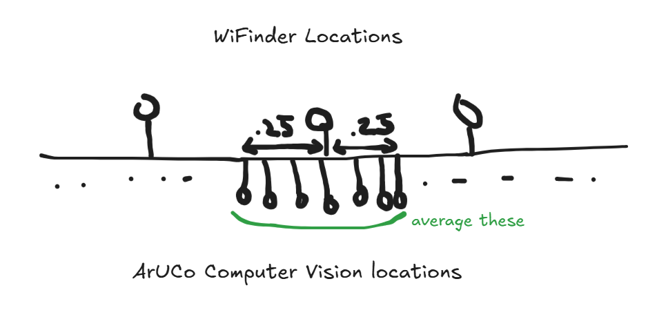

# Visualise Indoor Localisation Accuracy

## How to run a test

### Use online 🙂

[indoor-localisation-accuracy-testing-tool.vercel.app](https://indoor-localisation-accuracy-testing-tool.vercel.app)

### Run locally

Read the development instructions below.

## How accuracy is calculated?

The tools compares locations from indoor localisation with Computer Vision location recorded in a similar timeframe (e.g. within 0.25s).


## Development

### Setup

Install node (>v20) and npm (>10).

Once you've installed dependencies with `npm install` (or `pnpm install` or `yarn`), start a development server:

```sh
npm run dev

# or start the server and open the app in a new browser tab
npm run dev -- --open

# or open to host to preview on your phone (if connected to same WiFi network)
npm run dev -- --host
```

### Tech Stack

Developed with SvelteKit
Learn more about [Svelte](https://svelte.dev/tutorial/svelte/welcome-to-svelte) and [SvelteKit](https://svelte.dev/tutorial/kit/introducing-sveltekit)

### Building

To create a production version of your app:

```sh
npm run build
```

You can preview the production build with `npm run preview`.

> To deploy your app, you may need to install an [adapter](https://svelte.dev/docs/kit/adapters) for your target environment.
